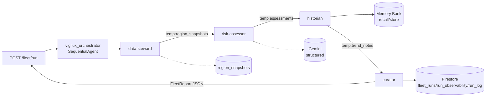

# Vigilux Sentinel - Architecture

## Problem

Field teams across regions submit snapshots on irregular cadences. Vigilux
Sentinel runs a **fleet** that turns those snapshots into a single, auditable
outbreak-intelligence report per run: which regions are at risk, why, whether a
region is getting better or worse compared to its own history, and what the
fleet spent its LLM budget on.

## Fleet topology

Everything is google-adk 1.x. The root is a plain `SequentialAgent`; it does
**no inference of its own**. It owns four fleet agents, each with a single
responsibility, its own bounded tools and instructions, and strict sequential
hand-off of state:

```
POST /fleet/run  (FastAPI)
   │
   ▼
vigilux_orchestrator  (SequentialAgent - deterministic pass-through)
   │
   ├─ data-steward     read region_snapshots (Firestore) ─────────────┐ no LLM
   │                                                                   │
   ├─ risk-assessor    per stale region: one Gemini call              ┐ │ LLM per
   │                   (response_schema=SignalAssessment) +           │ │ stale
   │                   deterministic heuristic fallback                │ │ region
   │                                                                   │ │
   ├─ historian        Memory Bank: recall prev assessment →          ┐ │ no LLM
   │                   TrendNote → store this assessment               │ │
   │                                                                   │ │
   ├─ curator          merge → FleetReport ─→ fleet_runs              ┐ │ no LLM
   │                   telemetry    ─→ run_observability              │ │
   │                   registry log ─→ run_log                        │ │
   │                                                                   │ │
   └──────────────────────────────► JSON FleetReport ◄────────────────┘ ┘
```

Data flows between agents through ADK session state under the ephemeral
`temp:` namespace (`temp:region_snapshots`, `temp:assessments`,
`temp:trend_notes`, `temp:fleet_report`). Run metadata (`temp:run_id`,
`temp:started_at`) is seeded by the API through
`Runner.run_async(state_delta=...)`.

## The four agents

| Agent | Responsibility | LLM? | Tools |
|---|---|---|---|
| data-steward | Read all region snapshots, hand structured data to the fleet | No | `firestore_tool.read_region_snapshots` |
| risk-assessor | A structured `SignalAssessment` per stale region (1 call each), skip fresh ones | Yes, one structured call per stale region | `assess_region` |
| historian | Cross-run baselines: recall -> TrendNote -> store | No | `memory_bank_tool.*`, `build_trend_note` |
| curator | Assemble + persist the FleetReport and return it | No | `build_fleet_report`, `firestore_tool.write_*`, `append_run_log` |

## Memory Bank (real role)

The historian is the only agent that reads and writes the Memory Bank. Each
assessment is scoped per region; the previous assessment for that region is
recalled *before* this run's assessment so trends can be computed, then the new
one is stored for the next run.

- **Real implementation**: a Vertex AI Agent Engine (Memory Bank) provisioned
  with `google-cloud-aiplatform`, scoping memories by
  `{"app_name": vigilux-sentinel, "user_id": region:<region_id>}`. Enabled by
  setting `MEMORY_BANK_AGENT_ENGINE_ID`.
- **Default fallback**: a compact Firestore rolling window
  (`assessment_history`, last 10 assessments per region). Same recall/store
  contract, no Agent Engine to provision. Chosen so the fleet runs out of the
  box; the real API path works without code changes.

## Observability (real role)

Every agent executes inside `observability.agent_span`:

1. An OpenTelemetry span (`agent.<name>`, attributes for `run_id` and
   `regions_processed`, `record_exception` on failure). Exported to **Cloud
   Trace** via `opentelemetry-exporter-gcp-trace` on Cloud Run.
2. A per-run JSON timing record (agent, started/ended, duration_ms,
   regions_processed, error). The curator persists these to
   `run_observability/<run_id>`; `GET /fleet/status` surfaces them.

## What is deliberately NOT implemented

These were out of scope and are called out explicitly:

- **Identity and Gateway (Agent Engine)**: no `/session/*`, model-gateway or
  identity endpoints. The fleet is driven through the FastAPI surface in
  `backend/agents/main.py`.
- **Dynamic registry API**: the registry is the static YAML catalog in
  `backend/agents/registry/agent_registry.yaml` plus the `run_log` collection
  written by the curator, not a live registry service.
- **Model Armor**: no integration. Gemini calls go directly through
  google-genai.

## Data flow (mermaid)

